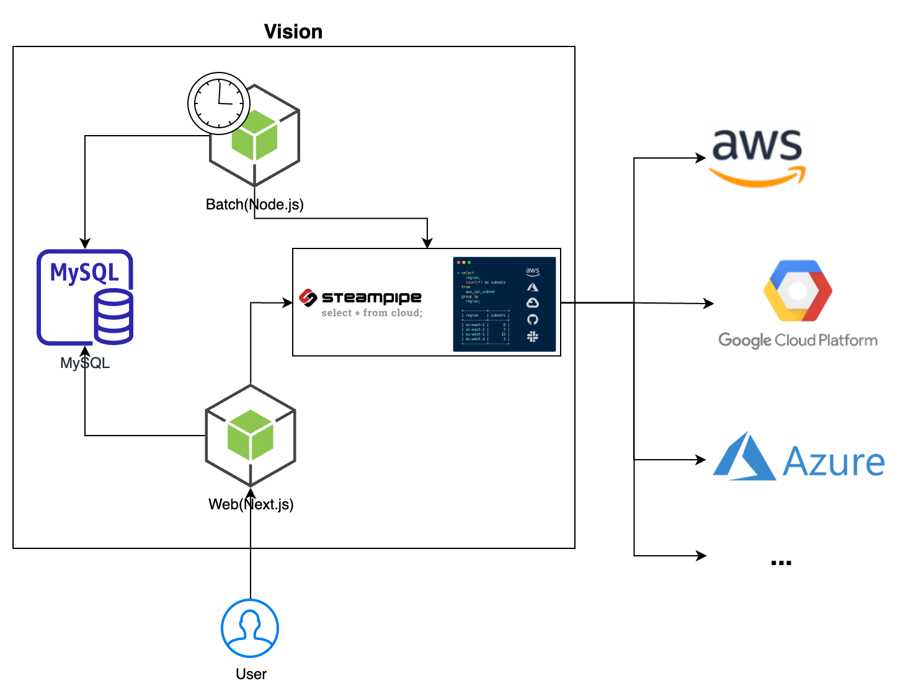
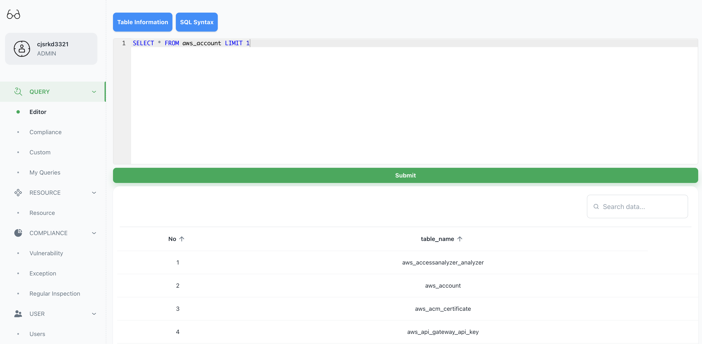

[ENGLISH](./README.md)
| [한국어](./README-ko.md)

# Vision

- This system can use for managing about CMDB(Configuration Management Database), Compliance Tracker, Regular Inspectation etc...

_Table of contents:_

- [SImple Architecture](#simple-architecture)
- [Tech Stacks](#tech-stacks)
- [Usage](#usage)
- [Additional Information](#additional-information)
  - [Menu](#menu)
    - [QUERY](#query)
    - [RESOURCE](#resource)
    - [COMPLIANCE](#compliance)
    - [USER](#user)
    - [COMMON(Not menu)](#common)
  - [Settings](#settings)
- [Additional Information](#additional-information)
  - [Menu](#menu)
    - [QUERY](#query)
    - [RESOURCE](#resource)
    - [COMPLIANCE](#compliance)
    - [USER](#user)
    - [COMMON(Not menu)](#common)
  - [Settings](#settings)
- [FAQ](#faq)
  - Can I use this system for other cloud like GCP, Azure etc?
  - We have SSL Visualization system on our company. What can I do for install npm packages?
  - I'm a PostgreSQL beginner. What can I do for a writing query? 🥲
- [Special Thanks](#special-thanks)

## Simple Architecture



## Tech Stacks

- Next.js + Node.js + MySQL + Steampipe + Prisma(ORM)

## Usage

- First, You should know how to [set your credential](https://hub.steampipe.io/plugins/turbot/aws) in steampipe directory.
- But, You can test this project on your local machine. For exmaple,
  - If you wanna test this system on your only one account? You have to delete about '\*sub1' in steampipe directory files(aws.spc, credentials, config)

```bash
# Current /steampipe/config file
[default]
region = ap-northeast-2
output=json

[sub1]
region = ap-northeast-2
output=json
```

- You create and set the 'credentials' file like below,

```bash
# /steampipe/credentials file
[default]
aws_access_key_id = AKIA...
aws_secret_access_key = SECRET_ACCESS_KEY

[sub1]
aws_access_key_id = AKIA...
aws_secret_access_key = SECRET_ACCESS_KEY
```

- If you wanna edit 'aws.spc' ? You can!

```bash
# /steampipe/aws.spc file
connection "aws_master" {
  plugin  = "aws"
  profile = "default"
  regions = ["ap-northeast-2"]

  options "connection" {
    cache     = false # true, false
    cache_ttl = 300  # expiration (TTL) in seconds
  }
}

connection "aws_sub1" {
  plugin    = "aws"
  profile   = "sub1"
  regions   = ["ap-northeast-2"]

  options "connection" {
    cache     = false # true, false
    cache_ttl = 300  # expiration (TTL) in seconds
  }
}

connection "aws_all" {
  plugin      = "aws"
  type        = "aggregator"
  connections = ["aws_master", "aws_sub1"]
}
```

- And now you run the script.

```bash
# You have to install Node.js, docker
# And run the docker on your local machine
# before run this command below
$ ./run.sh
```

- Finally, You have to check this application's status.

```bash
$ docker logs vision

...
2022/05/08 01:37:30 Problem with dial: dial tcp 172.21.0.2:3306: connect: connection refused. Sleeping 1s
...
> vision@0.1.0 start
> next start

ready - started server on 0.0.0.0:3000, url: http://localhost:3000
info  - Loaded env from /usr/src/app/.env
```

- Access http://localhost on your own browser.(Chrome recommended)
- Then, You'll see this screen below
  
  - **[IMPORTANT] THE FIRST USER TO LOGIN BECOMES AN ADMIN.**
- You'll see the query page after log in
  
- Press the 'Submit' button or ctrl(command) + enter, then you can see the result below
  
- Edit your query like below

```sql
SELECT
    account_id as account,
    region,
    group_id,
    group_name,
    security_group_rule_id,
    ip_protocol as protocol,
    CASE
        WHEN cidr_ip IS NULL
        THEN cidr_ipv6
        ELSE cidr_ip
        END AS ip,
    CASE
        WHEN from_port = to_port
        THEN from_port::varchar
        ELSE from_port::varchar || '-' || to_port::varchar
        END AS port
FROM
    aws_vpc_security_group_rule
WHERE
    type = 'ingress'
    AND (cidr_ip = '0.0.0.0/0' OR cidr_ipv6 = '::/0')
```

- See the results and Submit the above query with CATEGORY is 'COMPLIANCE' / TYPE is 'VPC' / NAME is 'SG_INGRESS_ANY_OPEN' and Click the 'Save Query'
  
- Select 'Vulnerability' in left side bar, and you can see your query's results(If no results, Maybe wait for 10s maximum.)
  
  - **[IMPORTANT] The current setting runs a saved query every 10 seconds and synchronizes the results every 300 seconds**
- If you wanna except your result then, you click the 'Exception' button and type your reason
  
- You can see the 'isDeleted' and 'isExcepted' on 'Regular Inspection' menu on left sidebar
  
- Now you should register 'CUSTOM' query. Click the 'Editor' on left sidebar and type the query like below

```sql
SELECT
  account_id,
  region,
  instance_id,
  title,
  instance_type,
  instance_state,
  iam_instance_profile_arn,
  metadata_options,
  private_ip_address,
  vpc_id,
  subnet_id,
  tags,
  security_groups,
  network_interfaces
FROM
  aws_ec2_instance
```

- And click the 'submit' button. Next, You can set CATEGORY is 'CUSTOM' / TYPE is 'EC2' / NAME is 'EC2_INFO'. And click the 'Save Query' button.
  
- Now you can see this result in 'Resource' Menu.

## Additional information

### Menu

#### QUERY

- Editor
  - Edit your query
  - You can see the tables
  - Query your query
  - Save query for CUSTOM or COMPLIANCE
    - COMPLIANCE only can ADMIN
- Compliance
  - You can view all the queries that people have created(COMPLIANCE).
- Custom
  - You can view all the queries that people have created(CUSTOM).
- My Queries
  - You can view all the queries that you have created(COMPLIANCE, CUSTOM)
  - USER role can make 5 queries only

#### RESOURCE

- Resource
  - You can view the 'CUSTOM' query's results

#### COMPLIANCE

- Vulnerability
  - You can view the 'COMPLIANCE' query's results
  - But, can't view excepted or deleted reuslts
- Exception
  - You can view the excepted results.
  - But, Deleted result not viewing
- Regular Inspection
  - For 'Regular Inspection'
  - You can see the all results(Even Deleted, Excepted results)
  - If you wanna see the 2022-2Q's results ?
    - OR: 2022-04 || 2022-05 || 2022-06

#### USER

- Users

  - Manage your users.
  - You can promote user to admin(ONLY CAN ADMIN ROLE)
  - But, You can't downgrade your user admin to user
  - This operation only can in DB

    ```bash
    $ cd batch
    $ npx prisma studio

    Need to install the following packages:
    prisma
    Ok to proceed? (y) y
    Environment variables loaded from .env
    Prisma schema loaded from prisma/schema.prisma
    Prisma Studio is up on http://localhost:5555

    # Open your browser automatically
    ```

    - Is it not working? Then, You can edit /batch/.env file.(DATABASE_URL)

#### COMMON

- Search
  - AND: 123 && 456
  - OR: 123 || 456
    - ex) OR: DELETED || EXCEPTED

### Settings

- Modify TTL to refresh

```bash
# run.sh
if [ -f ".env" ]; then
    echo ".env File exists."
else
    ...
    # Modified this value
    echo SP_TTL=300 >> .env
fi

docker-compose build
docker-compose up -d

docker rmi $(docker images -f "dangling=true" -q)
```

- Credentials
  - You can refer to [this link](https://hub.steampipe.io/plugins/turbot/aws)
  - If you wanna test your only one account? Then, You can edit this files(config, credentials, aws.spc in steampipe directory)
    - Delete data about 'aws_sub1'.

## FAQ

- Can I use this system for other cloud like GCP, Azure etc?
  - Yes, But You have to edit your Dockerfile(/steampipe/Dockerfile) and create other files
    1. steampipe plugin install aws(or gcp or azure etc...)
    2. For example GCP, set your credential refering [this link](https://hub.steampipe.io/plugins/turbot/gcp)
- We have SSL Visualization system on our company. What can I do for install npm packages?
  - You have to set the "NODE_EXTRA_CA_CERTS" environment variable.
  - refer to [this link](https://stackoverflow.com/questions/13913941/how-to-fix-ssl-certificate-error-when-running-npm-on-windows)
- I'm a PostgreSQL beginner. What can I do for a writing query? 🥲
  1. Simple query samples are [here](https://steampipe.io/docs)
  2. Advanced queries are [here](https://hub.steampipe.io/plugins/turbot/aws/tables)
  3. PostgreSQL docs are [here](https://www.postgresql.org/docs/)
  4. Additional query samples locate in /batch/src/quries
- I don't know how to run this application 😰
  - If you search your problem ENOUGH, open the issue please.
    - You must submit additional information like "What have you tried?", "When does the error happen?", "Do you see any error in the console?", "Submit your states using screenshots."

## Special Thanks

- [steampipe](https://github.com/turbot/steampipe)
- [steampipe-plugin-aws](https://github.com/turbot/steampipe-plugin-aws)
