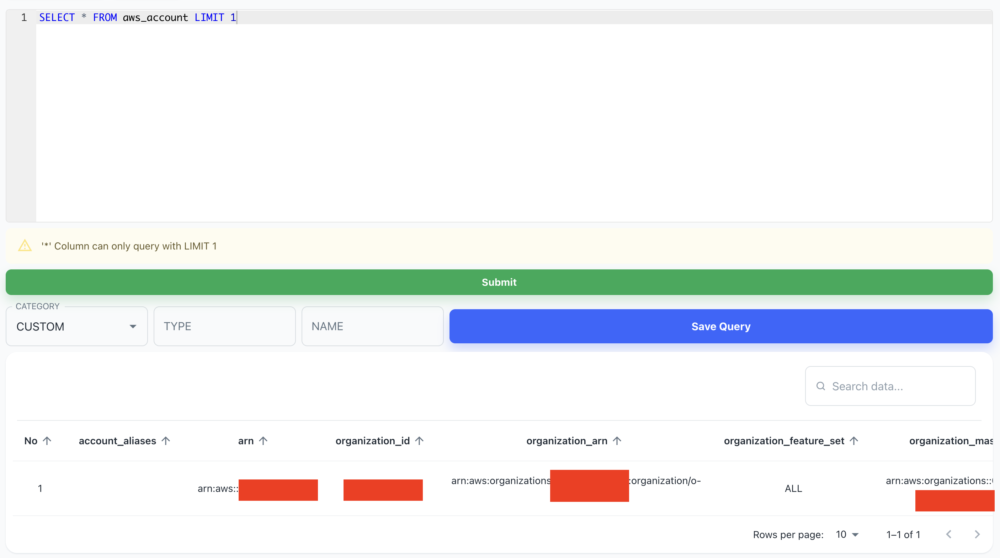

# Vision

## Simple Architecture

## Example

## Tech Stacks

- Next.js + Node.js + MySQL + Steampipe + Prisma(ORM)

## Usage

- First, You should know how to [set your credential](https://hub.steampipe.io/plugins/turbot/aws) in steampipe directory.
- But, You can test this project on your local machine. For exmaple,

```bash
# Current /steampipe/config file
[default]
region = ap-northeast-2
output=json

[sub1]
region = ap-northeast-2
output=json
```

- You create and set the 'credentials' file like below,

```bash
# /steampipe/credentials file
[default]
aws_access_key_id = AKIA...
aws_secret_access_key = SECRET_ACCESS_KEY

[sub1]
aws_access_key_id = AKIA...
aws_secret_access_key = SECRET_ACCESS_KEY
```

- And now you run the script.

```bash
# You have to install Node.js, docker
# And run the docker on your local machine
# before run this command below
$ ./run.sh
```

- Finally, You have to check this application's status.

```bash
$ docker logs vision

...
2022/05/08 01:37:30 Problem with dial: dial tcp 172.21.0.2:3306: connect: connection refused. Sleeping 1s
...
> vision@0.1.0 start
> next start

ready - started server on 0.0.0.0:3000, url: http://localhost:3000
info  - Loaded env from /usr/src/app/.env
```

- Access http://localhost on your own browser.(Chrome recommended)
- Then, You'll see this screen below
  
  - **[IMPORTANT] THE FIRST USER TO LOGIN BECOMES AN ADMIN.**
- You'll see the query page after log in
  
- Press the 'Submit' button or ctrl(command) + enter, then you can see the result below
  
